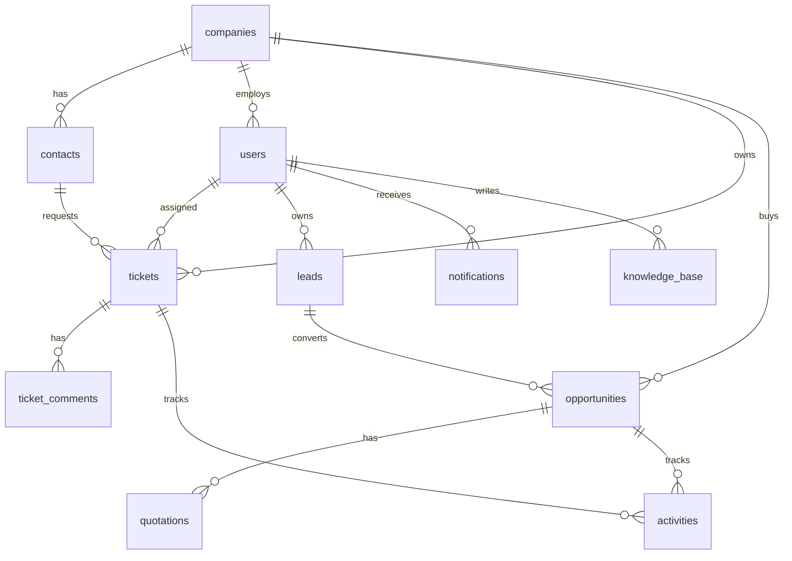

# Arquitectura del sistema

## Decision tecnologica recomendada

Para publicar sin servidor, Docker, Vercel ni Supabase, TechShield Support CRM queda preparado con una arquitectura web estatica:

- Frontend: HTML, CSS y JavaScript estatico en `web/`.
- Hosting: Netlify gratis, Cloudflare Pages o GitHub Pages.
- Base de datos: Firebase Firestore en plan gratuito.
- Autenticacion: Firebase Authentication con Email/Password.
- Archivos: Firebase Storage para adjuntos de tickets, reportes y cotizaciones.
- Automatizaciones: coleccion `notifications` como outbox para correo y WhatsApp.

El proyecto tambien conserva una base Next.js/Supabase en la raiz por si mas adelante quieres migrar a PostgreSQL, pero la ruta simple de publicacion es `web/` + Netlify + Firebase.

## Capas

1. Presentacion: `web/index.html`, `web/styles.css` y `web/app.js`.
2. Estado demo: `localStorage`, util para pruebas sin crear cuentas.
3. Datos reales: colecciones Firestore cuando `web/config.js` tiene Firebase configurado.
4. Archivos: Firebase Storage para imagenes, documentos, cotizaciones y reportes.
5. Operacion: GitHub + Netlify con despliegue automatico.

## Modelo ERD logico

## Colecciones Firestore

- `users`
- `companies`
- `contacts`
- `tickets`
- `ticket_comments`
- `leads`
- `opportunities`
- `quotations`
- `activities`
- `knowledge_base`
- `notifications`

## Seguridad

En demo, la app funciona sin login real y guarda en el navegador. En produccion:

- Firebase Auth valida usuarios.
- Firestore Rules deben exigir `request.auth != null`.
- Para multiempresa, agrega `companyId` a usuarios, tickets y oportunidades.
- Clientes solo deben leer/escribir documentos de su `companyId`.
- Administradores pueden administrar todo.
- Tecnicos gestionan tickets asignados.
- Vendedores gestionan leads, oportunidades, cotizaciones y actividades.

## Roadmap recomendado

1. Crear proyecto Firebase y pegar configuracion en `web/config.js`.
2. Agregar roles en documentos `users`.
3. Endurecer reglas Firestore por `role` y `companyId`.
4. Conectar Firebase Storage en formulario de tickets.
5. Agregar Cloud Functions o Make/Zapier para correo y WhatsApp.
6. Generar reportes PDF y cotizaciones descargables.
