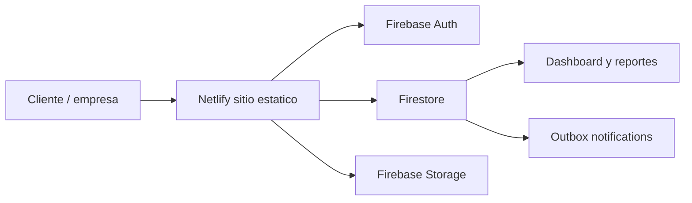

# TechShield Support CRM

Sistema web empresarial para TechShield que une mesa de ayuda, CRM comercial, portal de cliente, base de conocimiento, reportes y automatizaciones.

La version recomendada para publicar facil esta en `web/`: no requiere instalar dependencias, no usa Docker, no necesita Vercel y puede funcionar sin Supabase. Para datos reales usa Netlify + Firebase.

## Modulos incluidos

- Dashboard ejecutivo con tickets abiertos, SLA, ventas del mes y satisfaccion.
- Sistema de tickets con estados, prioridades, tecnicos, SLA y creacion de tickets.
- CRM con leads, oportunidades, cotizaciones, actividades y pipeline Kanban.
- Portal de cliente para crear tickets, ver estado, descargar reportes y aprobar cotizaciones.
- Base de conocimiento.
- Reportes y automatizaciones por correo, WhatsApp e in-app.
- Roles: administrador, tecnico, vendedor y cliente.
- Modo oscuro y claro.

## Ruta mas simple para publicar

## Estructura principal

- `web/index.html`: aplicacion lista para publicar.
- `web/styles.css`: UI corporativa responsive.
- `web/app.js`: tickets, CRM, portal, login demo y conexion Firebase opcional.
- `web/config.js`: credenciales publicas de Firebase.
- `web/FIREBASE-NETLIFY-PASO-A-PASO.md`: guia rapida de publicacion.
- `firebase/`: reglas de Firestore, Storage e indices.
- `ARCHITECTURE.md`: arquitectura y modelo ERD logico.
- `DEPLOYMENT.md`: manual de despliegue.
- `supabase/`: scripts SQL opcionales si en el futuro quieres PostgreSQL administrado.

## Como abrir en local

1. Entra a la carpeta `web`.
2. Abre `index.html` con doble clic.
3. Navega por Dashboard, Tickets, CRM, Portal, Base, Reportes, Ajustes y Acceso.

## Base de datos gratis recomendada

Para evitar Supabase por complejidad:

- Hosting: Netlify gratis.
- Base de datos: Firebase Firestore.
- Login: Firebase Authentication.
- Archivos: Firebase Storage.

La app funciona sin Firebase en modo demo y guarda tickets/leads nuevos en `localStorage`.

## Credenciales demo

- Administrador: `admin@techshieldsv.com` / `TechShield2026!`
- Tecnico: `tecnico@techshieldsv.com` / `TechShield2026!`
- Vendedor: `ventas@techshieldsv.com` / `TechShield2026!`
- Cliente: `cliente@example.com` / `TechShield2026!`

## Publicar en Netlify

1. Crea un repositorio en GitHub.
2. Sube el proyecto.
3. En Netlify selecciona Add new site > Import an existing project.
4. Build command: dejar vacio.
5. Publish directory: `web`.
6. Deploy.

Para datos reales, configura Firebase siguiendo `web/FIREBASE-NETLIFY-PASO-A-PASO.md`.

## Firebase incluido

Ya estan listos:

- `firebase/firestore.rules`
- `firebase/storage.rules`
- `firebase/firestore.indexes.json`
- `firebase/firebase.json`

Cuando un usuario demo inicia sesion, la app crea su perfil en `users/{uid}` y asigna rol segun `web/config.js`.
